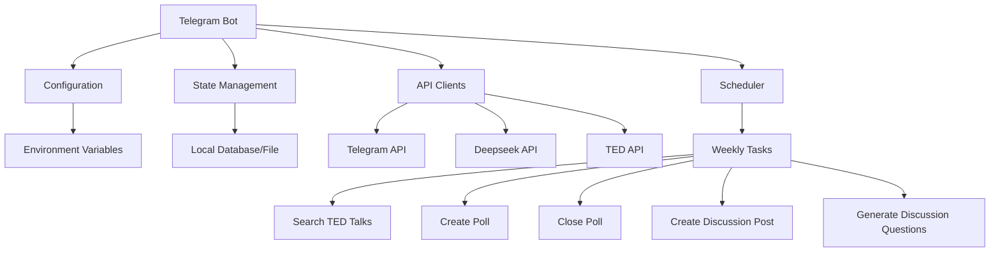

# TED Suggester Telegram Bot Architecture

## Overview


## Components

### 1. Configuration Manager
- Reads and validates environment variables:
  - `BOT_TOKEN`: Telegram bot token
  - `TOPIC_LIST`: Comma-separated list of TED talk topics
  - `DEEPSEEK_APIKEY`: Deepseek API key
  - `TG_GROUP_ID`: Telegram group ID
- Provides type-safe access to configuration values
- Validates required configurations at startup

### 2. State Management
- Uses SQLite database for persistent storage
- Tracks:
  - Suggested TED talks
  - Poll results
  - Discussion schedules
- Prevents duplicate suggestions
- Schema:
  ```sql
  CREATE TABLE talks (
      id TEXT PRIMARY KEY,
      title TEXT,
      description TEXT,
      suggested_at DATETIME,
      poll_message_id TEXT,
      selected BOOLEAN DEFAULT 0
  );
  ```

### 3. API Clients
#### Telegram API Client
- Handles bot interactions
- Manages:
  - Poll creation
  - Message posting
  - Message pinning
  - Error handling

#### Deepseek API Client
- Generates natural language:
  - TED talk descriptions
  - Discussion questions
  - Randomized messages
- Implements retry logic for API failures

#### TED API Client
- Searches for talks by topics
- Filters and ranks results
- Implements caching and retries

### 4. Scheduler
- Weekly schedule:
  - Monday 08:00: Search and create poll
  - Wednesday 18:00: Close poll
  - Sunday 12:00: Prepare discussion
- Uses Go's time.Ticker for scheduling
- Implements error recovery

### 5. Core Logic
#### TED Talk Search
- Searches by topics from TOPIC_LIST
- Filters results based on:
  - Relevance
  - Duration
  - Popularity
- Selects 5-6 candidates

#### Poll Management
- Creates Telegram polls with:
  - Talk titles
  - Short descriptions
  - Randomized options order
- Tracks poll results

#### Discussion Preparation
- Generates discussion post with:
  - Selected talk details
  - Discussion time (Sunday 18:00 Berlin time)
  - Pinned message
- Creates 3-4 discussion questions

### Error Handling
- Implements retry logic for:
  - API calls
  - Database operations
  - Telegram interactions
- Exponential backoff strategy
- Fallback mechanisms for critical failures

## Deployment
- Containerized using Podman
- GitHub Actions for CI/CD
- Environment variables for configuration